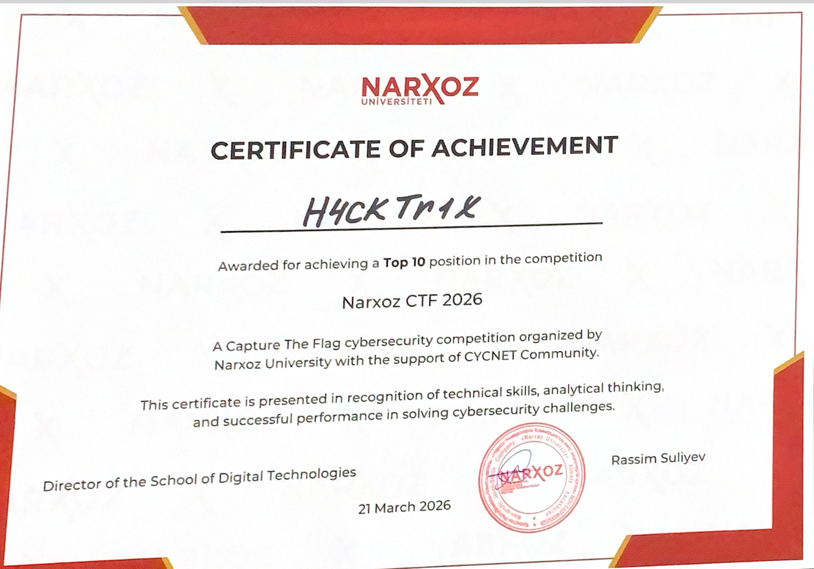

#  Yernar's CTF Writeups

Repository containing detailed CTF writeups across multiple categories, showcasing practical cybersecurity and offensive security skills.

##  Repository Structure
The repository is organized by CTF events. Each folder contains writeups for challenges solved during that competition:

```text
yernar-ctf-writeups/
├── ctf-name/
│   ├── web/
│   ├── crypto/
│   ├── pwn/
│   └── misc/
└── another-ctf/
    └── ...
```
##  Achievements
* **Top 10 (6th place)** in the university CTF competition


## Skills Demonstrated
- Vulnerability Analysis
- Web Exploitation (XSS, SSTI, etc.)
- Cryptography Attacks
- Reverse Engineering Basics
- Steganography
- Problem-Solving in CTF environments

##  Disclaimer
> All challenges were solved in legal, authorized CTF environments. The scripts, exploits, and methods shared in this repository are for **educational purposes only**.

## Contact
* **LinkedIn:** [Yernar Karimov](https://www.linkedin.com/in/yernar-karimov-9265b4350/)

## 🔧 TODO
- add big reverse solution(aitu)
- add Wireshark(Narxoz)
- add PicoCTF and THM solutions